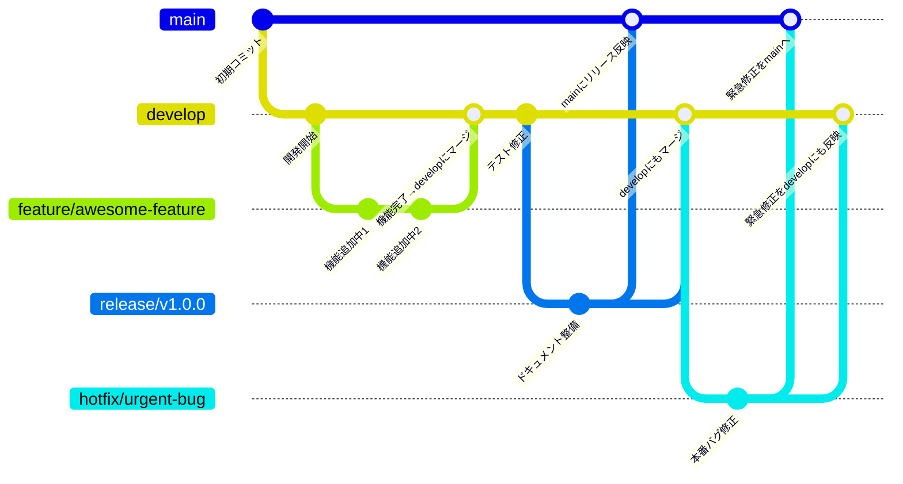

## ブランチ戦略

基本方針は **Feature Branch + Pull Request Review** です。

- `main`：本番リリース用の安定ブランチ
- `develop`：開発の統合ブランチ
- `feature/*`：機能追加
- `bugfix/*`：バグ修正
- `hotfix/*`：本番の緊急修正
- `release/*`：リリース準備用のブランチ



---

## ブランチ命名規則


```
feature/<概要>-issue-<issue番号>
bugfix/<概要>-issue-<issue番号>
hotfix/<概要>
```

例：
- `feature/CTM-101-add-login-page-issue-103`
- `bugfix/CTM-204-fix-date-format-issue-99`
