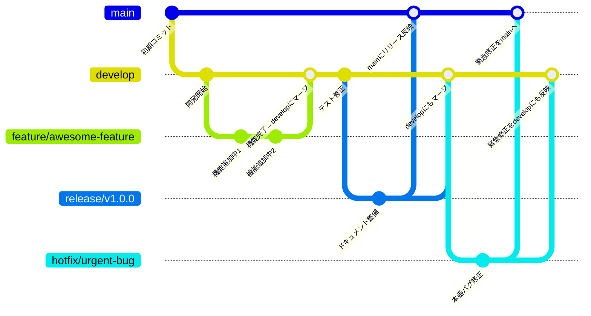

# Team Development Guidelines

このリポジトリは、当Organizationの開発チームが共通で遵守すべきルール・ガイドラインをまとめたものです。

---

## 目次

- [ブランチ戦略](#ブランチ戦略)
- [ブランチ命名規則](#ブランチ命名規則)
- [Pull Request の運用](#pull-request-の運用)
- [コミットメッセージの書き方](#コミットメッセージの書き方)
- [リリースフロー](#リリースフロー)
- [その他のルール](#その他のルール)

---

## ブランチ戦略

基本方針は **Feature Branch + Pull Request Review** です。

- `main`：本番リリース用の安定ブランチ
- `develop`：開発の統合ブランチ
- `feature/*`：機能追加
- `bugfix/*`：バグ修正
- `hotfix/*`：本番の緊急修正
- `release/*`：リリース準備用のブランチ




---

## ブランチ命名規則


```
feature/<概要>-issue-<issue番号>
bugfix/<概要>-issue-<issue番号>
hotfix/<概要>
```

例：
- `feature/CTM-101-add-login-page-issue-103`
- `bugfix/CTM-204-fix-date-format-issue-99`

---

## Pull Request の運用

- **PRは必ず別のメンバーのレビューを受ける**
- タイトルと説明はわかりやすく記述
- WIP（作業中）の場合は `Draft` を使う
- `main` へ直接 push は禁止

---

## コミットメッセージの書き方

### 形式

```
<emoji> <subject> #issue-no
```

#### example：

- `:memo: README.mdにコミットメッセージの書き方追加 `
- `:bug: ログアウト後にログイン情報が残ってしまうバグ修正 #22`

### テンプレートを使用
#### `~/.github/commit.template`ファイルを作成

```commit.template


# ==== Format ====
# :emoji: Subject #issue No.
#
# Commit body...

# ==== Emojis ====
# :memo:         ドキュメント作成
# :bug:          バグ修正
# :+1:           機能改善
# :sparkles:     部分的な機能追加
# :tada:         盛大に祝うべき大きな機能追加
# :recycle:      リファクタリング
# :shower:       不要な機能・使われなくなった機能の削除
# :green_heart:  テストやCIの修正・改善
# :shirt:        Lintエラーの修正やコードスタイルの修正
# :rocket:       パフォーマンス改善
# :up:           依存パッケージなどのアップデート
# :lock:         新機能の公開範囲の制限
# :cop:          セキュリティ関連の改善

# ==== The Seven Rules ====
# 1. Separate subject from body with a blank line
# 2. Limit the subject line to 50 characters
# 3. Capitalize the subject line
# 4. Do not end the subject line with a period
# 5. Use the imperative mood in the subject line
# 6. Wrap the body at 72 characters
# 7. Use the body to explain what and why vs. how
#
```

#### git config コマンドを実行
```bash
git config --global commit.template ~/.github/commit.template
```


---

## 開発フロー

1. **Issueを作成**
1. **最新の`develop`をpull**
   ```bash
   git switch develop
   git pull origin develop
   ```
1. **`develop`からブランチを作成**
   - ブランチ名: `feature/<概要>-issue-<Issue番号>`
   - 例: `feature/add-login-form-issue-42`
   ```bash
   git switch -c "feature/add-login-form-issue-42"
   ```
1. **作業ブランチに commit&push**
   ```bash
   # 変更をステージング
   git add .
   git commit # ファイルが開くので開発内容を記載
   git push origin "feature/add-login-form-issue-42"
   ```
1. **`develop` 宛に Pull Request を作成**

---

## 📎 その他のルール

- **コードレビューは原則24時間以内に対応**
- **CIチェックを通過したPRのみマージ可**
- **ドキュメントやREADMEもコードの一部とみなす**

---
